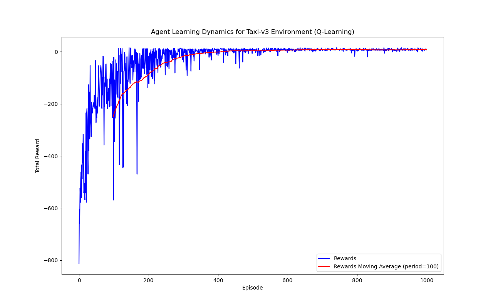

# otus-ht01
## Домашнее задание №1
В ходе выполнения задания был реализован класс Agent agent.py для обучения агента методами Q-Learning и SARSA для дискретной среды с дискретными действиями.

Скрипт train_agent.py обучает агента используя среду Taxi-v3, выдаёт график динамики обучения - значения наград и скользящее среднее за период n (по умолчанию 100) и сохраняет Q-функцию агента (numpy массив) в файле agent_qfunction.npy. Параметры обучения агента задаются в файле .config.yml

Скрипт run_agent.py загружает сохраннёную Q-функцию агента из файла agent_qfunction.npy, запускает агента в среде Taxi-v3 количество раз заданное параметром episode_n и вычисляет среднее значение награды по всем эпизодам.

